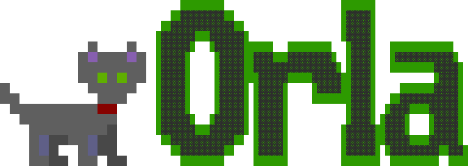

<p align="center">
  
</p>

<p align="center">
  <a href="https://goreportcard.com/report/github.com/harvard-cns/orla"></a>
  <a href="https://www.bestpractices.dev/projects/6573"></a>
  <a href="https://github.com/harvard-cns/orla/actions/workflows/build.yml"></a>
  <a href="https://github.com/harvard-cns/orla/actions/workflows/pyorla-ci.yml"></a>
  <a href="https://pypi.org/project/pyorla/"></a>
</p>

Orla is a library for building and running LLM-based agentic systems. Modern agentic applications are workflows that combine multiple LLM calls, tool invocations, and heterogeneous infrastructure. Today, developers often stitch these pieces together manually using orchestration code, LLM serving engines, and tool execution logic.

Orla simplifies this process by separating workflow-level decisions from request execution. Developers define workflows as stages, while Orla handles how those stages are mapped to models and backends, scheduled and executed, and coordinated through shared inference state.


The system exposes three core components: a Stage Mapper for heterogeneous model routing, a Workflow Orchestrator for executing and scheduling stages, and a Memory Manager that manages KV cache across workflow stages.

<p align="center">
  <a href="https://seas.harvard.edu/"></a>
</p>

<p align="center">
  Orla is a project of Dr. <a href="https://seas.harvard.edu/person/minlan-yu">Minlan Yu</a>'s lab at <a href="https://seas.harvard.edu/">Harvard SEAS</a>.
</p>

## Contributing

We welcome any and all open-source contributions to orla. Orla is designed to be a community-focused project and runs on individual contributions from amazing people around the world. This [document](CONTRIBUTING.md) provides guidelines and instructions for contributing to the project.

## Getting Started


<p align="center">
  
</p>

Installing the orla daemon:

```bash
brew install --cask harvard-cns/orla/orla
```

Installing the orla client SDK:

```bash
pip install pyorla
```

Visit our [website](https://orlaserver.github.io) to learn more.

## Citation

If you use Orla for your research, we would greatly appreciate it if you cite our demo [paper](https://arxiv.org/abs/2603.13605).


```
@misc{shahout2026orlalibraryservingllmbased,
      title={Orla: A Library for Serving LLM-Based Multi-Agent Systems}, 
      author={Rana Shahout and Hayder Tirmazi and Minlan Yu and Michael Mitzenmacher},
      year={2026},
      eprint={2603.13605},
      archivePrefix={arXiv},
      primaryClass={cs.AI},
      url={https://arxiv.org/abs/2603.13605}, 
}
```

## Contacting Us

- For technical questions and feature requests, please use [GitHub Issues](https://github.com/harvard-cns/orla/issues)
- For security disclosures, please see [SECURITY.md](SECURITY.md).

