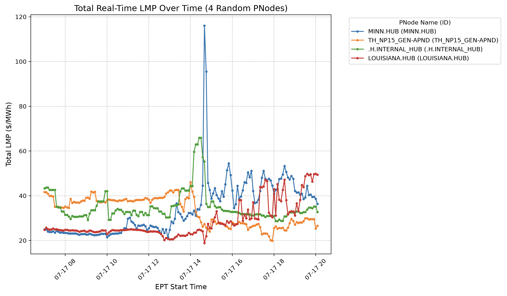

# Price and Carbon Intensity Data

Real-Time prices are typically reported at 5 minute granularity. These prices can vary across service zones as well as within those zones. The image below shows prices for 4 chosen locations across the US area across 13 hours of July 17, 2026

There are 7 ISOs (regional governing areas) within the continental US. For our testing, we can either:
- Select different locations within a single ISO
- Compare data across US ISOs
- Compare data across US and International providers

## Price Data sources
To access price data, you can either rely on self-reported ISO data or compiled data from 3rd parties. In both cases, there is typically a UI interface to directly download files and an API option to download programmatically. Typically each ISO publishes both hub data (1-10 per ISO) or node data (1000s per ISO).

Examples
- Grid Status: able to access US and Canadian ISO data with free account (limited downloads)
- ISO New England: 5 minute LMP data no limits, specific to New England
- Ercot: Texas ISO, data is a bit harder to access. Prices only 15 min intervals
- PJM Dataminer 2: PJM service area data

### What I have done
I have written a script `generate.py` which will access data from CAISO (california), MISO (midwest), and ISO-NE (new england) hubs for the past day. This outputs the file `5min_hub_lmps.csv`. We can then filter this data to include 3-4 specified locations and only look at timesteps with shared data using `filter_data.py` which outputs to `filtered_overlapping_hubs.csv`.

The current contents of `filtered_overlapping_hubs.csv` includes 13 hours of data (UTS 07:00-19:55) from July 17, 2026 from:
- "TH_NP15_GEN-APND" (CAISO) 
- "LOUISIANA.HUB" (MISO) 
- "MINN.HUB" (MISO) 
- ".H.INTERNAL_HUB" (ISO-NE)

## Emissions Data Sources
Electricity Maps: able to access US and international data with academic accounts. Only displays emissions/carbon intensity data, not prices. Granularity within [5m, 15m, hour, daily]
